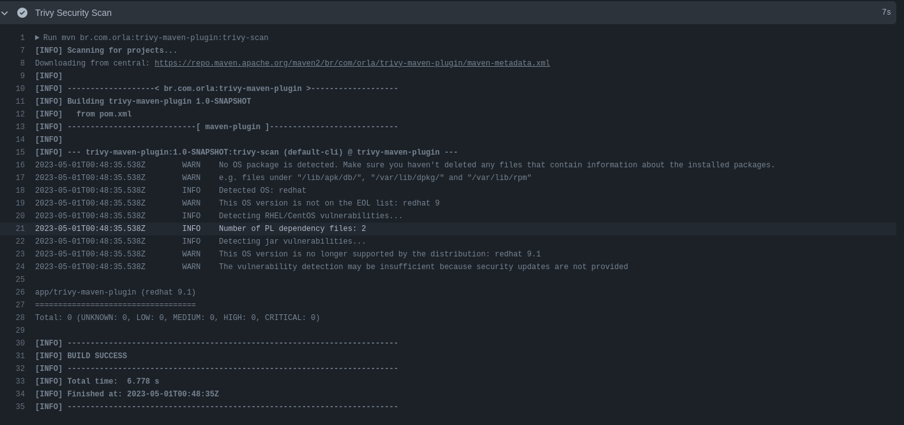

# trivy-maven-plugin

This is a Maven plugin developed to simplify the process of scanning Docker images for vulnerabilities using Trivy.

This plugin utilizes Trivy as a security tool, operating in the background to enhance the protection and reliability of our software. Trivy is an open-source vulnerability analysis tool developed by [AquaSecurity](https://github.com/aquasecurity).

[](https://github.com/orladigital/trivy-maven-plugin/actions/workflows/maven.yml)



## About the Plugin
The plugin has been created to streamline the task of performing Docker image scans for security vulnerabilities using the Trivy tool.

With this plugin, you can easily integrate security analysis into your Maven development workflow, enabling early detection of potential vulnerabilities in your Docker images.

## Prerequisites

Before using this plugin, please ensure that `Docker` is installed on your system.

The plugin relies on Docker for scanning Docker images.

And `Java 11` +

## Usage
Add the Maven plugin to your project's pom.xml file, specifying the required configurations.

```xml
<plugin>
    <groupId>br.com.orla</groupId>
    <artifactId>trivy-maven-plugin</artifactId>
    <version>1.0-SNAPSHOT</version>
    <configuration>
        <vulnType>os,library</vulnType>
        <severity>HIGH,CRITICAL</severity>
        <ignoreUnfixed>true</ignoreUnfixed>
    </configuration>
    <executions>
        <execution>
            <goals>
                <goal>trivy-scan</goal>
            </goals>
        </execution>
    </executions>
</plugin>
```
Run the appropriate Maven command to perform Docker image scanning using the plugin. For example, `mvn br.com.orla:trivy-maven-plugin:trivy-scan`

## Configuration
The plugin provides the following basic configuration:

* `dockerFilePath`: path to the Dockerfile. Default: current directory.
* `vulnType`: vulnerability types to be analyzed. Default: all vulnerabilities.
* `severity`: minimum severity of vulnerabilities to be displayed. Default: all severities.
* `ignoreUnfixed`: ignore unfixed vulnerabilities. Default: false.

## Contributing
Contributions are welcome! Feel free to fork this repository, create a branch, make the desired changes, and submit a pull request.

## License
This plugin is licensed under the Apache License 2.0
